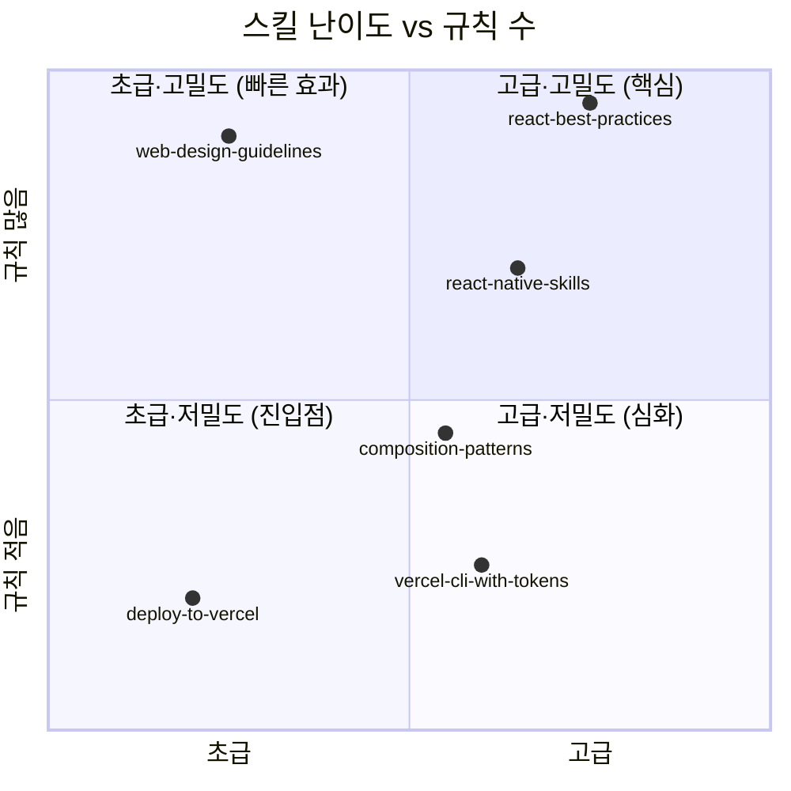
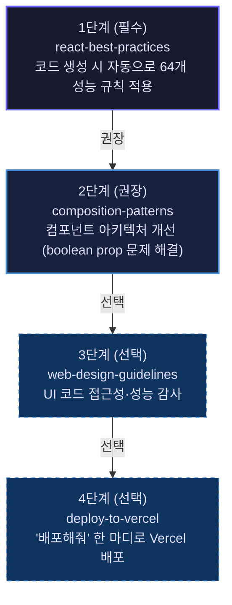
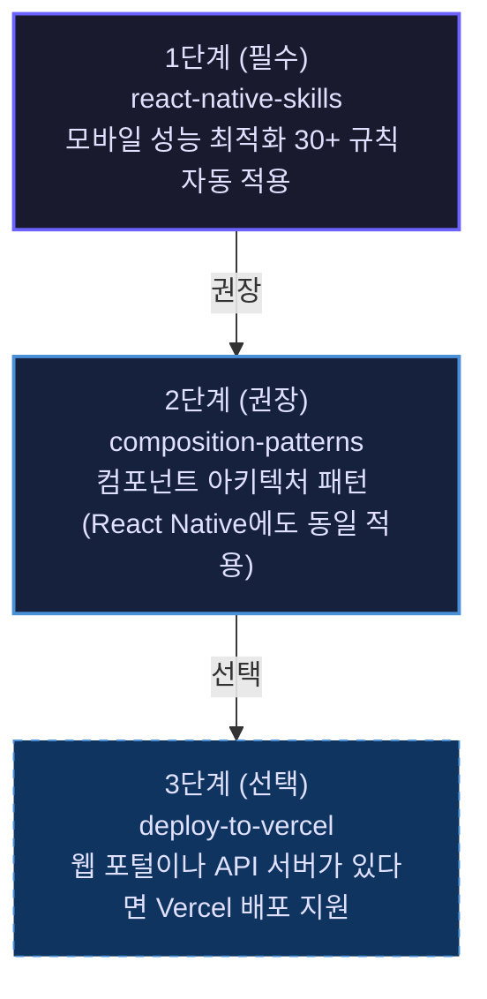
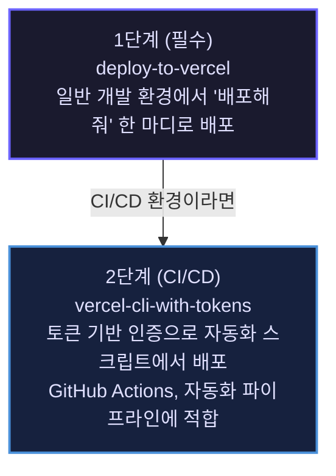
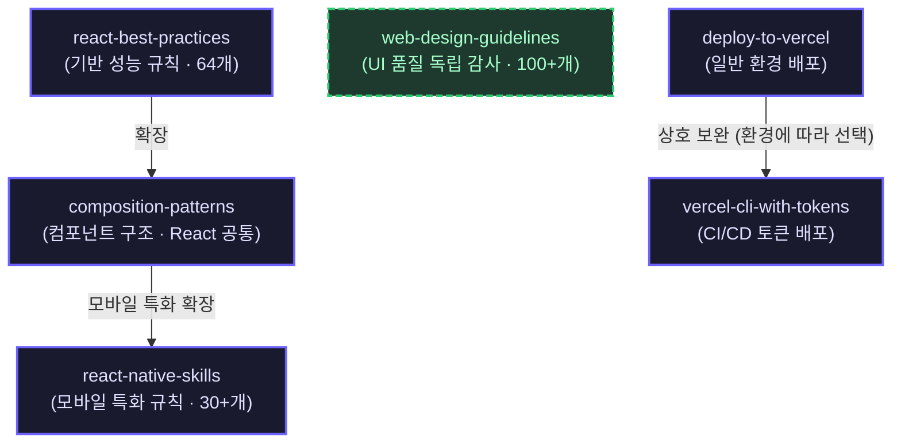

# 학습 경로 가이드

**어떤 스킬을 어떤 순서로 설치하고 사용해야 할까?**

---

## 이 문서의 목적

6개 스킬은 각각 독립적으로 돌아가지만, 역할이나 상황에 따라 **어떤 걸 먼저 쓸지**가 달라집니다. 역할별 학습 경로 세 가지와 실제 사용 시나리오를 담았습니다.

---

## 스킬 난이도 개요

| 스킬 | 난이도 | 적합한 대상 |
|------|-------|-----------|
| `deploy-to-vercel` | ★☆☆ 초급 | 배포가 처음인 개발자 |
| `web-design-guidelines` | ★☆☆ 초급 | UI 코드 작성자 |
| `react-best-practices` | ★★★ 초~고급 | React/Next.js 개발자 |
| `composition-patterns` | ★★☆ 중급 | React 컴포넌트 설계자 |
| `react-native-skills` | ★★☆ 중~고급 | 모바일 앱 개발자 |
| `vercel-cli-with-tokens` | ★★☆ 중급 | DevOps/CI 담당자 |

아래 차트는 각 스킬의 **난이도(x축)**와 **규칙 수(y축)**를 한눈에 보여줍니다. 오른쪽 위일수록 배우면 얻는 것이 많은 스킬입니다.



---

## 역할별 학습 경로

### 경로 A: React/Next.js 개발자

"성능 잘 나오는 React 앱, AI 에이전트랑 같이 만들고 싶다"



**설치 명령:**

```bash
for skill in react-best-practices composition-patterns web-design-guidelines deploy-to-vercel; do
  cp -r ~/guide/origin/agent-skills/skills/$skill ~/.claude/skills/
done
```

---

### 경로 B: React Native 개발자

"Expo/React Native 앱 성능이랑 UI, AI랑 같이 잡고 싶다"



**설치 명령:**

```bash
for skill in react-native-skills composition-patterns; do
  cp -r ~/guide/origin/agent-skills/skills/$skill ~/.claude/skills/
done
```

---

### 경로 C: 배포 담당자 / DevOps

"Vercel 배포 자동화하고, CI/CD에서 에이전트가 알아서 굴러가게 하고 싶다"



**설치 명령:**

```bash
for skill in deploy-to-vercel vercel-cli-with-tokens; do
  cp -r ~/guide/origin/agent-skills/skills/$skill ~/.claude/skills/
done
```

---

### 경로 D: 풀스택 개발자 (전체 설치)

```bash
# 모든 스킬 한 번에 설치
npx skills add vercel-labs/agent-skills

# 또는 수동으로
for skill in react-best-practices composition-patterns react-native-skills web-design-guidelines deploy-to-vercel vercel-cli-with-tokens; do
  cp -r ~/guide/origin/agent-skills/skills/$skill ~/.claude/skills/
done
```

---

## 스킬 연결 관계

아래 그래프는 스킬 간 **기반·확장·독립** 관계를 보여줍니다. 화살표 방향은 "이 스킬이 저 스킬을 확장한다"는 의미입니다.



---

## 시나리오별 실행 가이드

### 시나리오 1: "새 Next.js 프로젝트 시작"

```
1. react-best-practices 설치
2. Claude에게: "Next.js 앱에서 사용자 목록 페이지 만들어줘"
   → 에이전트가 자동으로:
      - Promise.all로 병렬 데이터 페칭
      - dynamic import로 번들 최적화
      - React.cache()로 서버 캐싱
      - useMemo로 리렌더 최적화
```

### 시나리오 2: "기존 컴포넌트 리팩토링"

```
1. composition-patterns 설치
2. Claude에게: "이 컴포넌트 boolean prop 너무 많아. 리팩토링해줘"
   → 에이전트가 자동으로:
      - Compound Component 패턴 제안
      - State Provider로 state lift
      - 명시적 variant 컴포넌트로 분리
```

### 시나리오 3: "React Native 앱 리스트 성능 개선"

```
1. react-native-skills 설치
2. Claude에게: "FlatList 스크롤이 너무 버벅여. 최적화해줘"
   → 에이전트가 자동으로:
      - FlashList로 교체
      - renderItem 콜백 호이스팅
      - 인라인 객체 제거
      - 아이템 메모이제이션
```

### 시나리오 4: "UI 접근성 감사"

```
1. web-design-guidelines 설치
2. Claude에게: "src/components/ 접근성 체크해줘"
   → 에이전트가 자동으로:
      - 최신 가이드라인 fetch
      - 100+ 규칙으로 파일 분석
      - file:line 형식으로 위반 사항 보고
```

### 시나리오 5: "Vercel에 빠르게 배포"

```
1. deploy-to-vercel 설치
2. Claude에게: "이 프로젝트 Vercel에 배포해줘"
   → 에이전트가 자동으로:
      - git remote, .vercel/, CLI 인증 상태 확인
      - 최적의 방법 선택 (Git Push / CLI / Fallback)
      - 팀 선택 후 배포
      - Preview URL 반환
```

### 시나리오 6: "CI/CD에서 자동 배포"

```
1. vercel-cli-with-tokens 설치
2. Claude에게: "VERCEL_TOKEN이 있어. GitHub Actions에서 Vercel 배포 설정해줘"
   → 에이전트가 자동으로:
      - 환경변수에서 토큰 탐지
      - 안전한 토큰 사용 방법 적용
      - CI 환경에 맞는 배포 스크립트 생성
```

---

## 우선순위 선택 기준

**React/Next.js 코드 품질이 가장 중요하다면**:
→ `react-best-practices` + `composition-patterns`

**모바일 앱을 만들고 있다면**:
→ `react-native-skills`

**UI 품질과 접근성이 중요하다면**:
→ `web-design-guidelines`

**빠른 배포가 필요하다면**:
→ `deploy-to-vercel`

**자동화 환경에서 배포한다면**:
→ `vercel-cli-with-tokens`

---

## 스킬 활성화 확인

설치 후 Claude Code에서 이렇게 테스트해볼 수 있습니다:

```bash
# 설치된 스킬 확인
ls ~/.claude/skills/

# 테스트 (react-best-practices)
# Claude Code에서: "React에서 두 개의 독립적인 API를 호출하는 방법 보여줘"
# → Promise.all 패턴을 자동으로 사용하면 스킬이 활성화된 것입니다

# 테스트 (deploy-to-vercel)
# Claude Code에서: "이 프로젝트 배포해줘"
# → 프로젝트 상태를 확인하고 배포 방법을 안내하면 스킬이 활성화된 것입니다
```
