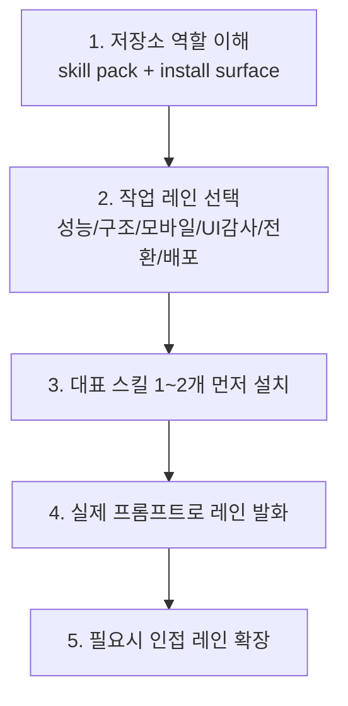

# 학습 경로 가이드

이 문서는 Vercel Agent Skills를 **개별 스킬 이름 목록**이 아니라 **작업 레인 묶음**으로 익히기 위한 학습 순서를 제시한다.

핵심 원칙은 하나다.

> **프레임워크 이름보다 먼저, 지금 필요한 작업 레인이 무엇인지부터 정하라.**

---

## 현재 읽는 법

현재 upstream은 다음 7개 스킬 축으로 읽는 편이 맞다.

1. `react-best-practices`
2. `composition-patterns`
3. `react-native-guidelines`
4. `web-design-guidelines`
5. `react-view-transitions`
6. `vercel-deploy-claimable`
7. `vercel-cli-with-tokens`

즉 예전처럼 “6개 스킬 개요”로만 보면 최신 흐름을 반쯤 놓치게 된다.

---

## 학습 경로 개요

---

## 경로 A — React / Next.js 개발자

### 추천 순서

1. `react-best-practices`
2. `composition-patterns`
3. `react-view-transitions`
4. 필요 시 `web-design-guidelines`

### 이 순서가 맞는 이유

- 먼저 성능과 데이터 페칭 기본기를 잡고
- 그다음 컴포넌트 구조를 정리하고
- 이후 전환 애니메이션을 얹는 편이 안전하다

전환 효과는 멋있지만, 기본 성능/구조가 약한 상태에서 먼저 올리면 오히려 품질이 흐려진다.

---

## 경로 B — React Native / Expo 개발자

### 추천 순서

1. `react-native-guidelines`
2. `composition-patterns`
3. 필요 시 `web-design-guidelines`

### 핵심 포인트

모바일은 웹과 다른 병목이 있다.

- 리스트 가상화
- 애니메이션 / gesture
- 이미지 로딩
- safe area / keyboard handling

따라서 React 일반론보다 먼저 **모바일 레인**을 잡는 편이 맞다.

---

## 경로 C — UI 품질 감사 / 접근성 점검

### 추천 순서

1. `web-design-guidelines`
2. 필요 시 `react-best-practices`
3. 필요 시 `react-view-transitions`

### 핵심 포인트

이 경로는 새 코드를 생성하기보다, 이미 있는 UI를 **감사하고 교정**하는 데 적합하다.

---

## 경로 D — 배포 담당자 / 자동화 담당자

### 추천 순서

1. `vercel-deploy-claimable`
2. `vercel-cli-with-tokens`

### 구분 기준

- 대화형/직접 배포 중심이면 `vercel-deploy-claimable`
- CI/CD와 토큰 기반 자동화면 `vercel-cli-with-tokens`

배포 레인은 구현 레인과 목적이 다르다. 따라서 별도 축으로 기억하는 편이 좋다.

---

## 가장 추천하는 빠른 입문 순서

1. `sections/01-overview.md`
2. `categories/overview.md`
3. 내 작업에 맞는 대표 스킬 1개
4. 인접 스킬 1개
5. `02-glossary.md`

예:
- Next.js 성능 문제 → `react-best-practices` → `composition-patterns`
- UI 감사 → `web-design-guidelines`
- 배포 → `vercel-deploy-claimable`

---

## 자주 틀리는 학습 순서

### 잘못된 순서 1

`모든 스킬을 한 번에 이해하려고 하기`

왜 틀리나:
- 이 저장소는 skill pack이기 때문에, 실제로는 자기 작업 레인에 맞는 것부터 익히는 편이 훨씬 효율적이다.

### 잘못된 순서 2

`애니메이션 레인을 먼저 파기`

왜 틀리나:
- `react-view-transitions`는 멋지지만, 기본 성능과 구조가 흔들리면 오히려 품질을 해친다.

### 잘못된 순서 3

`배포 스킬을 프론트엔드 품질 스킬과 같은 축으로 보기`

왜 틀리나:
- 배포 레인은 코드 품질 감사가 아니라 전달/출시 자동화 표면이다.

---

## 최종 체크리스트

- [ ] 지금 필요한 작업 레인을 하나로 좁혔다
- [ ] 대표 스킬 1개를 먼저 읽고 설치했다
- [ ] 인접 스킬과의 관계를 이해했다
- [ ] `react-view-transitions`가 새 핵심 축이라는 점을 반영했다
