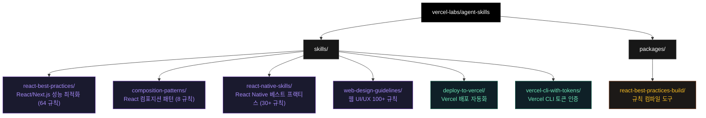
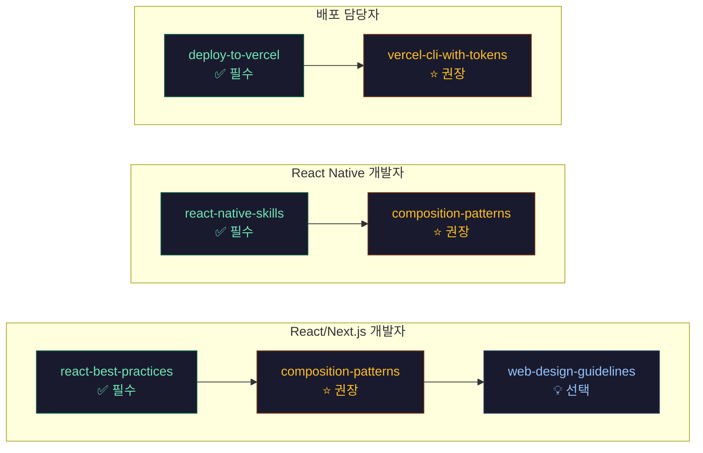

# Vercel Agent Skills 마스터 가이드

**AI 에이전트 스킬 실전 가이드**

---

## 이 가이드는 무엇인가?

[Vercel Labs Agent Skills](https://github.com/vercel-labs/agent-skills)에 올라온 **6개 에이전트 스킬**을 뜯어본 문서입니다. 각 스킬이 뭘 하는지, 언제 쓰는지, 어떻게 설치하는지 정리했습니다.

Agent Skills는 **Claude Code, Claude.ai, Codex** 같은 AI 코딩 에이전트에 끼워 쓰는 확장 기능입니다. 설치해두면 에이전트가 관련 요청을 받을 때 스킬의 지식을 꺼내 씁니다. "React 컴포넌트 작성해줘"라고 하면 Vercel Engineering이 정리한 64개 성능 규칙을 알아서 들고 나오는 식입니다.

각 스킬의 **원본 소스**를 직접 분석해서, 실제로 어떤 규칙이 들어있고 어떤 상황에 쓰면 좋은지 한국어로 풀었습니다.

---

## 대상 독자

이런 분들에게 유용합니다.

- **Claude Code, Cursor, Copilot 사용자**: AI 코딩 에이전트는 쓰고 있는데 에이전트 스킬이 뭔지 잘 모르는 분
- **React / Next.js 개발자**: Vercel Engineering의 성능 최적화 노하우를 에이전트에 녹여 쓰고 싶은 분
- **React Native 개발자**: 모바일 개발할 때 자주 빠뜨리는 성능 패턴을 에이전트가 대신 챙겨주길 바라는 분
- **Vercel 배포 담당자**: 배포 작업을 말 한 마디로 처리하고 싶은 분

---

## Agent Skills란?

Agent Skills는 **에이전트에 심어두는 전문 지식 패키지**입니다.

작동 방식:

1. 스킬을 설치합니다 (`npx skills add vercel-labs/agent-skills` 또는 `cp`)
2. 에이전트가 대화 중에 관련 스킬을 감지합니다
3. 스킬의 규칙과 가이드라인을 꺼내 더 나은 코드를 만듭니다

예를 들어 `react-best-practices` 스킬을 설치한 상태에서 "이 Next.js 페이지 최적화해줘"라고 하면, 단순히 코드를 고치는 게 아니라 **Waterfall 제거, Bundle 최적화, Server-side 캐싱** 순서대로 우선순위에 맞춰 개선해줍니다.

---

## Agent Skills 생태계 전체 구조

> 6개 스킬은 `skills/` 폴더에, 규칙 컴파일 도구는 `packages/` 폴더에 분리되어 있습니다. 일반적으로 `skills/` 하위 스킬만 설치하면 됩니다.



---

## 6개 스킬 개요

### 1. react-best-practices (React 성능 최적화)

| 항목 | 내용 |
|------|------|
| **핵심 설명** | Vercel Engineering이 실전에서 검증한 React/Next.js 성능 최적화 가이드. 64개 규칙이 8개 우선순위 카테고리로 정리되어 있습니다. |
| **주요 규칙** | Promise.all 병렬 처리, dynamic import, React.cache(), useMemo, 번들 barrel import 금지, Suspense 경계 설정 |
| **난이도 범위** | 초급 ~ 고급 |
| **언제 사용하나** | React 컴포넌트 작성 중, Next.js 데이터 페칭 구현 중, 성능 리뷰 중, 번들 최적화 작업 중 |
| **트리거 키워드** | "React 컴포넌트 만들어줘", "Next.js 페이지 최적화", "번들 사이즈 줄여줘", "성능 리뷰" |
| **상세 문서** | [categories/react-best-practices.md](categories/react-best-practices.md) |

### 2. composition-patterns (React 컴포지션 패턴)

| 항목 | 내용 |
|------|------|
| **핵심 설명** | Boolean prop 남용을 막는 React 컴포지션 패턴 모음. Compound Component, State Lifting, Context Interface 패턴을 체계적으로 정리합니다. |
| **주요 규칙** | Compound Components, State Lift, Context Interface, Children over renderX, Explicit Variants |
| **난이도 범위** | 중급 ~ 고급 |
| **언제 사용하나** | Boolean prop이 많은 컴포넌트 리팩토링 중, 재사용 컴포넌트 라이브러리 설계 중, Prop Drilling 해결 중 |
| **트리거 키워드** | "컴포넌트 리팩토링", "boolean props 정리", "컴포넌트 라이브러리 설계" |
| **상세 문서** | [categories/composition-patterns.md](categories/composition-patterns.md) |

### 3. react-native-skills (React Native 가이드라인)

| 항목 | 내용 |
|------|------|
| **핵심 설명** | React Native 및 Expo 앱의 성능과 아키텍처 최적화 가이드. 30개 이상 규칙이 렌더링, 리스트 성능, 애니메이션, UI 등 14개 섹션으로 구성됩니다. |
| **주요 규칙** | FlashList 가상화, GPU 속성 애니메이션, 네이티브 네비게이터, Pressable, expo-image |
| **난이도 범위** | 초급 ~ 고급 |
| **언제 사용하나** | React Native/Expo 앱 개발 중, 모바일 성능 최적화 중, 애니메이션/제스처 구현 중 |
| **트리거 키워드** | "React Native 앱 만들어줘", "Expo 최적화", "모바일 리스트 성능" |
| **상세 문서** | [categories/react-native-skills.md](categories/react-native-skills.md) |

### 4. web-design-guidelines (웹 인터페이스 가이드라인)

| 항목 | 내용 |
|------|------|
| **핵심 설명** | 웹 UI 코드를 100개 이상 규칙으로 감사하는 스킬. 접근성(a11y), 성능, UX, 폼 처리, 애니메이션, 다크모드 등을 체계적으로 점검합니다. |
| **주요 규칙** | ARIA 레이블, 포커스 상태, 폼 자동완성, prefers-reduced-motion, 레이지 로딩, URL 상태 반영 |
| **난이도 범위** | 초급 ~ 중급 |
| **언제 사용하나** | UI 코드 리뷰 중, 접근성 감사 중, UX 점검 중, 사이트 품질 개선 중 |
| **트리거 키워드** | "UI 리뷰해줘", "접근성 체크", "디자인 감사", "UX 점검" |
| **상세 문서** | [categories/web-design-guidelines.md](categories/web-design-guidelines.md) |

### 5. deploy-to-vercel (Vercel 배포)

| 항목 | 내용 |
|------|------|
| **핵심 설명** | 프로젝트를 Vercel에 배포하는 전체 흐름을 자동화합니다. 프로젝트 상태(linked/unlinked, CLI 인증 여부)를 자동 감지해 최적의 배포 방법을 선택합니다. |
| **주요 기능** | Git Push 배포, CLI 배포, 인증 없는 Fallback 배포, 팀 선택, 클레임 URL 제공 |
| **난이도 범위** | 초급 |
| **언제 사용하나** | 프로젝트를 Vercel에 올릴 때, 프리뷰 URL이 필요할 때, CI/CD 없이 빠르게 배포할 때 |
| **트리거 키워드** | "배포해줘", "deploy my app", "push this live", "Vercel에 올려줘" |
| **상세 문서** | [categories/deploy-to-vercel.md](categories/deploy-to-vercel.md) |

### 6. vercel-cli-with-tokens (Vercel CLI 토큰 인증)

| 항목 | 내용 |
|------|------|
| **핵심 설명** | 대화형 로그인(vercel login) 없이 토큰 기반으로 Vercel CLI를 사용하는 방법을 안내합니다. CI/CD 환경이나 자동화 스크립트에 적합합니다. |
| **주요 기능** | VERCEL_TOKEN 환경변수 설정, 프로젝트 링크, 배포, 환경변수 관리, 도메인 관리 |
| **난이도 범위** | 중급 |
| **언제 사용하나** | CI/CD 파이프라인에서 Vercel 배포 중, 토큰이 있는 상태에서 vercel 명령 실행 중 |
| **트리거 키워드** | "Vercel 토큰으로 배포", "vercel env 설정", "CI에서 vercel 배포" |
| **상세 문서** | [categories/vercel-cli-with-tokens.md](categories/vercel-cli-with-tokens.md) |

---

## 추천 학습 경로 요약

역할에 따라 필요한 것만 골라서 설치하면 됩니다.

> 각 역할에 맞는 최단 경로를 따라가면 바로 실전에 투입할 수 있습니다. 필수 → 권장 → 선택 순서로 진행하세요.



자세한 학습 경로, 스킬 간 연결 관계, 시나리오별 실행 순서는 [01-learning-paths.md](01-learning-paths.md)를 참조하세요.

---

## 설치 방법

### 방법 1: npx (권장)

```bash
npx skills add vercel-labs/agent-skills
```

전체 스킬 패키지를 한 번에 설치합니다.

### 방법 2: Claude Code 수동 설치

```bash
# 특정 스킬만 설치
cp -r ~/guide/origin/agent-skills/skills/react-best-practices ~/.claude/skills/

# 여러 스킬 설치
for skill in react-best-practices composition-patterns react-native-skills; do
  cp -r ~/guide/origin/agent-skills/skills/$skill ~/.claude/skills/
done
```

### 방법 3: claude.ai 웹에서 사용

스킬의 `SKILL.md` 파일 내용을 프로젝트 지식(Project Knowledge)에 붙여넣으면 됩니다.

---

## 문서 구조

```
vercel-agent-skills-guide/
├── README.md                          # 이 문서 (전체 개요)
├── 01-learning-paths.md               # 학습 경로 상세 가이드
├── 02-glossary.md                     # Agent Skills 용어 사전 (30+ 용어)
└── categories/                        # 스킬별 상세 문서
    ├── react-best-practices.md        # React/Next.js 성능 최적화 (64 규칙)
    ├── composition-patterns.md        # React 컴포지션 패턴 (8 규칙)
    ├── react-native-skills.md         # React Native 가이드라인 (30+ 규칙)
    ├── web-design-guidelines.md       # 웹 인터페이스 가이드라인 (100+ 규칙)
    ├── deploy-to-vercel.md            # Vercel 배포 자동화
    └── vercel-cli-with-tokens.md      # Vercel CLI 토큰 인증
```

---

## 참고 자료

### Agent Skills 원본

- **GitHub**: [https://github.com/vercel-labs/agent-skills](https://github.com/vercel-labs/agent-skills) — 6개 스킬의 원본 코드
- **Agent Skills 포맷**: [https://agentskills.io/](https://agentskills.io/) — 스킬 파일 형식 표준

### Vercel 공식 문서

- **Vercel 배포 가이드**: Next.js, Vite, Astro 등 40+ 프레임워크 배포 방법
- **Vercel CLI 문서**: CLI 명령어 전체 레퍼런스
- **Web Interface Guidelines**: [웹 UI 100+ 규칙 원본](https://github.com/vercel-labs/web-interface-guidelines)

### 관련 기술

| 기술 | 용도 | 관련 스킬 |
|------|------|----------|
| **Next.js** | React 풀스택 프레임워크 | react-best-practices |
| **React 19** | 최신 React (forwardRef 제거 등) | react-best-practices, composition-patterns |
| **Expo** | React Native 개발 플랫폼 | react-native-skills |
| **Reanimated** | React Native 고성능 애니메이션 | react-native-skills |
| **Vercel CLI** | 배포 및 관리 CLI 도구 | deploy-to-vercel, vercel-cli-with-tokens |

---

> 이 가이드에 대한 질문이나 개선 제안은 GitHub Issues로 남겨주세요.

<!-- GUIDE_SYNC:START -->
## 자동 동기화 상태

- origin repo: `agent-skills`
- latest source commit: `d8d9f624bc54`
- sync mode: `update`
- 영향 분류: 스킬/플러그인

### 이번 반영 포인트

origin 변경 파일을 기준으로 guide 문서의 관련 섹션을 다시 읽고 반영했습니다. 핵심 영향 영역: 스킬/플러그인.

### 최근 upstream 커밋

- `d8d9f62 Refine react-view-transition skill to include details about loading.tsx`
- `8de1770 Specify nextjs canary relationship better in react-view-transition skill`
- `5a4b5e1 Add more patterns to react-view-transition skill`
- `b8dbce9 Add limitation note to react-view-transition skill`
- `48bda1c Refine react-view-transition skill`

### 변경 파일 샘플

- `skills/react-view-transitions.zip`
- `skills/react-view-transitions/AGENTS.md`
- `skills/react-view-transitions/README.md`
- `skills/react-view-transitions/SKILL.md`
- `skills/react-view-transitions/references/css-recipes.md`
- `skills/react-view-transitions/references/implementation.md`
- `skills/react-view-transitions/references/nextjs.md`
- `skills/react-view-transitions/references/patterns.md`

> 이 블록은 guide sync가 자동 갱신합니다.
<!-- GUIDE_SYNC:END -->
