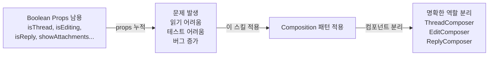
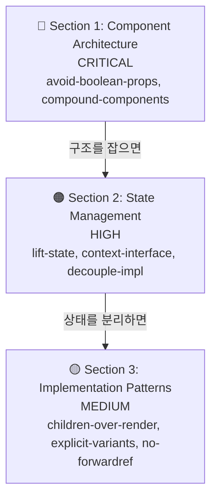
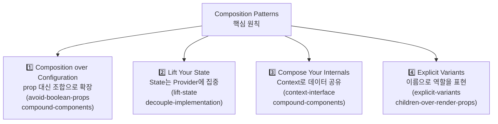

# Composition Patterns (React 컴포지션 패턴)

## 스킬 소개

React 컴포넌트 설계에서 흔한 **Boolean Prop 남용**을 컴포지션으로 해결하는 패턴 모음입니다. 8개 규칙을 3개 섹션으로 나눠, 에이전트가 처음부터 확장하기 좋은 컴포넌트를 짜도록 이끕니다.

---

## 이 스킬이 필요한 이유

컴포넌트가 커지다 보면 어느 순간 이렇게 됩니다:

```tsx
// 이렇게 시작했지만...
<Composer />

// 어느새 이렇게 됩니다
<Composer
  isThread={true}
  isEditing={false}
  isReply={true}
  showAttachments={false}
  hasToolbar={true}
  compactMode={false}
/>
```

Boolean prop이 쌓일수록 읽기도 어렵고 테스트도 어렵고 버그도 늘어납니다. 이 스킬은 그 문제를 **컴포지션으로 푸는 방법**을 에이전트에 심어둡니다.



---

## 스킬 메타데이터

| 항목 | 내용 |
|------|------|
| **스킬 이름** | `composition-patterns` |
| **버전** | (metadata.json 참조) |
| **저자** | Vercel Engineering |
| **규칙 수** | 8개 |
| **섹션 수** | 3개 |

---

## 3개 섹션 한눈에 보기

| 섹션 | 영향도 | 규칙 수 |
|------|-------|--------|
| Component Architecture (컴포넌트 아키텍처) | **CRITICAL** | 2 |
| State Management (상태 관리) | **HIGH** | 3 |
| Implementation Patterns (구현 패턴) | **MEDIUM** | 3 |



> 위에서 아래로 갈수록 영향도는 낮아지지만, 세 섹션 모두 함께 적용해야 완성도 있는 컴포지션 설계가 됩니다.

---

## 섹션 1: Component Architecture (CRITICAL)

### `architecture-avoid-boolean-props` — Boolean Prop 추가 금지

**규칙**: 동작을 바꾸려고 boolean prop을 추가하지 마라.

**왜**: boolean prop은 컴포넌트 안에 분기 로직을 쌓아갑니다. 어느 순간 컴포넌트가 여러 역할을 동시에 떠안게 되어 파악하기 힘들어집니다.

```tsx
// 나쁜 예: boolean prop으로 동작 분기
function Composer({ isThread, isEditing, isReply }) {
  return (
    <div>
      {isThread && <ThreadHeader />}
      {isEditing && <EditToolbar />}
      {isReply && <ReplyIndicator />}
      <TextArea />
    </div>
  );
}

// 좋은 예: 별도 컴포넌트로 명확한 역할 분리
function ThreadComposer() { ... }
function EditComposer() { ... }
function ReplyComposer() { ... }
```

### `architecture-compound-components` — Compound Components 구조화

**규칙**: 공유 컨텍스트를 쓰는 compound component로 구조화하라.

**왜**: 내부 상태는 감추면서도 조합은 자유롭게 할 수 있는 패턴입니다.

```tsx
// 좋은 예: Compound Component
<Dialog>
  <Dialog.Trigger>열기</Dialog.Trigger>
  <Dialog.Content>
    <Dialog.Header>제목</Dialog.Header>
    <Dialog.Body>내용</Dialog.Body>
    <Dialog.Footer>
      <Dialog.Close>닫기</Dialog.Close>
    </Dialog.Footer>
  </Dialog.Content>
</Dialog>
```

---

## 섹션 2: State Management (HIGH)

### `state-lift-state` — State를 Provider로 Lift

**규칙**: State를 provider 컴포넌트에 위치시켜라.

```tsx
// 좋은 예: State가 Provider에 집중됨
function DialogProvider({ children }) {
  const [open, setOpen] = useState(false);
  return (
    <DialogContext.Provider value={{ open, setOpen }}>
      {children}
    </DialogContext.Provider>
  );
}
```

### `state-context-interface` — Context 인터페이스 명확히 정의

**규칙**: state/actions/meta를 명확히 구분한 context 인터페이스를 정의하라.

```tsx
interface DialogContextValue {
  // state
  open: boolean;
  // actions
  openDialog: () => void;
  closeDialog: () => void;
  // meta
  dialogId: string;
}
```

### `state-decouple-implementation` — UI에서 State 관리 분리

**규칙**: state 관리를 UI 렌더링에서 분리하라.

```tsx
// 로직은 훅에, UI는 컴포넌트에
function useDialogState() {
  const [open, setOpen] = useState(false);
  return { open, open: () => setOpen(true), close: () => setOpen(false) };
}

function Dialog({ children }) {
  const state = useDialogState();
  return <DialogContext.Provider value={state}>{children}</DialogContext.Provider>;
}
```

---

## 섹션 3: Implementation Patterns (MEDIUM)

### `patterns-children-over-render-props` — renderX props 대신 children

**규칙**: `renderHeader` 같은 render prop 대신 children을 사용하라.

```tsx
// 나쁜 예: render props
<Card
  renderHeader={() => <h2>제목</h2>}
  renderFooter={() => <Button>확인</Button>}
/>

// 좋은 예: children 컴포지션
<Card>
  <Card.Header><h2>제목</h2></Card.Header>
  <Card.Footer><Button>확인</Button></Card.Footer>
</Card>
```

### `patterns-explicit-variants` — 명시적 Variant 컴포넌트

**규칙**: boolean prop 대신 명시적 이름의 variant 컴포넌트를 만들어라.

```tsx
// 나쁜 예
<Composer isThread={true} />

// 좋은 예: 이름에서 역할이 명확
<ThreadComposer />
<EditComposer />
<ReplyComposer />
```

### `react19-no-forwardref` — React 19: forwardRef 제거

**규칙**: React 19에서는 `forwardRef` 없이 ref를 prop으로 직접 전달하라.

```tsx
// React 19 이전
const Input = forwardRef((props, ref) => <input ref={ref} {...props} />);

// React 19 이후: ref를 일반 prop으로
function Input({ ref, ...props }) {
  return <input ref={ref} {...props} />;
}
```

---

## 4가지 핵심 원칙

이 스킬의 규칙들은 결국 이 4가지로 수렴합니다:

1. **Composition over configuration** — prop 늘리는 대신 소비자가 직접 조합하게 두라
2. **Lift your state** — State는 provider에, UI는 컴포넌트에
3. **Compose your internals** — 서브컴포넌트는 props 대신 context에서 데이터를 가져와라
4. **Explicit variants** — `isThread` 대신 `ThreadComposer`로 이름으로 말하라



---

## 사용 시점

| 상황 | 이 스킬이 도움이 되는 이유 |
|------|------------------------|
| Boolean prop이 3개 이상인 컴포넌트 | 리팩토링 방향 안내 |
| 재사용 컴포넌트 라이브러리 설계 | 처음부터 올바른 구조 |
| Prop Drilling이 깊어질 때 | Context 기반 해결책 제시 |
| 컴포넌트 API 설계 리뷰 | 설계 원칙 기반 피드백 |

---

## 설치 및 활성화

```bash
cp -r ~/guide/origin/agent-skills/skills/composition-patterns ~/.claude/skills/
```

---

## 추가 자료

- **원본 스킬 파일**: `~/guide/origin/agent-skills/skills/composition-patterns/`
- **개별 규칙 파일**: `skills/composition-patterns/rules/` 폴더 내 8개 `.md` 파일
