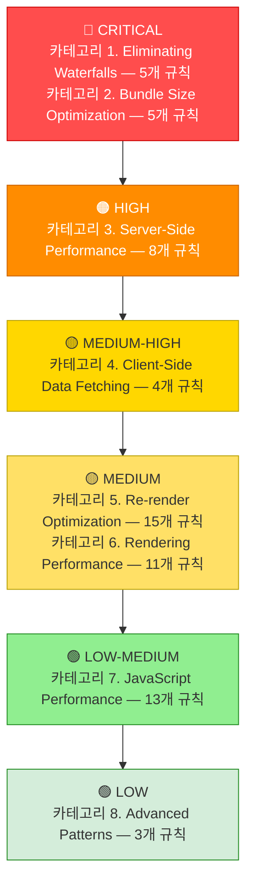
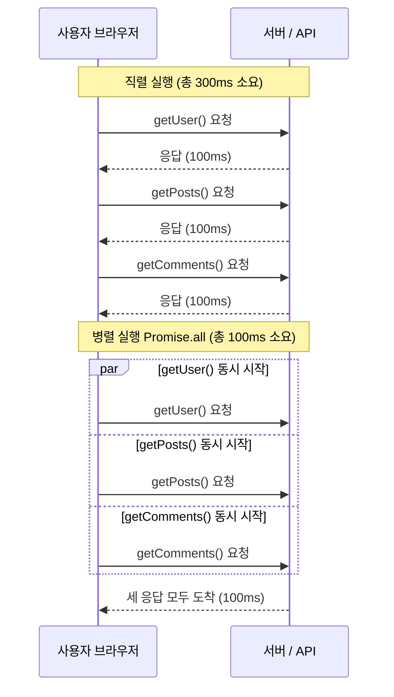

# React Best Practices (React/Next.js 성능 최적화)

## 스킬 소개

Vercel Engineering이 실전에서 검증한 **React/Next.js 성능 규칙 64개**를 에이전트에 심는 스킬입니다. React 코드를 짜거나 리뷰할 때 우선순위대로 성능 문제를 잡아냅니다.

린팅 규칙 모음이 아닙니다. **"왜 느린가"를 원인부터 짚는** 실전 지식을 8개 카테고리로 묶었습니다.

---

## 이 스킬이 필요한 이유

React/Next.js 앱 성능 문제는 대부분 같은 패턴에서 반복됩니다:

- **Waterfall (폭포수 문제)**: 독립적으로 실행해도 되는 API 호출이 줄줄이 직렬로 실행됨
- **번들 크기 폭증**: barrel import나 무거운 라이브러리 동기 로딩으로 초기 로드가 느려짐
- **불필요한 리렌더**: 메모이제이션 누락, 인라인 객체/함수로 연쇄 리렌더 발생

이 스킬이 있으면 에이전트가 이런 패턴을 알아보고 처음부터 제대로 된 코드를 뽑아냅니다.

---

## 스킬 메타데이터

| 항목 | 내용 |
|------|------|
| **스킬 이름** | `vercel-react-best-practices` |
| **버전** | 1.0.0 |
| **저자** | Vercel Engineering |
| **규칙 수** | 64개 |
| **카테고리 수** | 8개 |
| **라이선스** | MIT |

---

## 8개 카테고리 한눈에 보기

| 우선순위 | 카테고리 | 영향도 | 규칙 접두사 | 규칙 수 |
|---------|---------|-------|------------|--------|
| 1 | Eliminating Waterfalls (폭포수 제거) | **CRITICAL** | `async-` | 5 |
| 2 | Bundle Size Optimization (번들 최적화) | **CRITICAL** | `bundle-` | 5 |
| 3 | Server-Side Performance (서버 성능) | **HIGH** | `server-` | 8 |
| 4 | Client-Side Data Fetching (클라이언트 데이터) | **MEDIUM-HIGH** | `client-` | 4 |
| 5 | Re-render Optimization (리렌더 최적화) | **MEDIUM** | `rerender-` | 15 |
| 6 | Rendering Performance (렌더링 성능) | **MEDIUM** | `rendering-` | 11 |
| 7 | JavaScript Performance (JS 성능) | **LOW-MEDIUM** | `js-` | 13 |
| 8 | Advanced Patterns (고급 패턴) | **LOW** | `advanced-` | 3 |



> **읽는 법**: 위로 갈수록 성능에 미치는 영향이 크고, 먼저 점검해야 합니다. CRITICAL 두 카테고리(Waterfall 제거, 번들 최적화)가 가장 즉각적인 효과를 냅니다.

---

## 카테고리 1: Eliminating Waterfalls (CRITICAL)

**왜 중요한가**: 독립적으로 실행할 수 있는 API를 직렬로 쌓으면 N배 느려집니다. 가장 먼저 확인할 카테고리입니다.

| 규칙 | 설명 |
|------|------|
| `async-defer-await` | `await`를 실제로 값이 필요한 지점까지 미뤄라 |
| `async-parallel` | 독립적인 비동기 작업은 `Promise.all()`로 병렬 실행하라 |
| `async-dependencies` | 부분 의존성이 있는 경우 `better-all`을 사용하라 |
| `async-api-routes` | API 라우트에서는 Promise를 일찍 시작하고 나중에 await하라 |
| `async-suspense-boundaries` | Suspense를 사용해 콘텐츠를 스트리밍하라 |

**실전 예시:**

아래 다이어그램은 직렬(나쁜 예)과 병렬(좋은 예) 실행의 차이를 보여줍니다.



> **핵심**: 세 요청이 서로 독립적이라면 동시에 시작해야 합니다. `Promise.all()`을 쓰면 가장 느린 요청 하나의 시간만 기다리면 됩니다.

```typescript
// 나쁜 예: 직렬 실행 (총 300ms)
const user = await getUser(id);       // 100ms
const posts = await getPosts(id);     // 100ms
const comments = await getComments(); // 100ms

// 좋은 예: 병렬 실행 (총 100ms)
const [user, posts, comments] = await Promise.all([
  getUser(id),
  getPosts(id),
  getComments()
]);
```

---

## 카테고리 2: Bundle Size Optimization (CRITICAL)

**왜 중요한가**: 번들 크기가 곧 초기 로드 시간입니다. 안 쓰는 코드도 사용자가 다 받아야 합니다.

| 규칙 | 설명 |
|------|------|
| `bundle-barrel-imports` | barrel 파일(`index.ts`) 경유 import 금지 — 직접 import |
| `bundle-dynamic-imports` | 무거운 컴포넌트는 `next/dynamic`으로 지연 로딩 |
| `bundle-defer-third-party` | analytics, logging 등 서드파티는 hydration 후 로드 |
| `bundle-conditional` | 기능이 활성화될 때만 모듈 로드 |
| `bundle-preload` | hover/focus 시 preload로 체감 속도 개선 |

**실전 예시:**

```typescript
// 나쁜 예: barrel import (모든 컴포넌트가 번들에 포함됨)
import { Button, Modal, Table, Chart } from '@/components';

// 좋은 예: 직접 import
import { Button } from '@/components/Button';
import { Modal } from '@/components/Modal';

// 나쁜 예: 무거운 차트 라이브러리 동기 import
import { HeavyChart } from 'heavy-chart-lib';

// 좋은 예: 지연 로딩
const HeavyChart = dynamic(() => import('heavy-chart-lib'), { ssr: false });
```

---

## 카테고리 3: Server-Side Performance (HIGH)

**왜 중요한가**: RSC(React Server Components) 시대에서 서버 컴포넌트와 캐싱 전략이 성능을 좌우합니다.

| 규칙 | 설명 |
|------|------|
| `server-auth-actions` | Server Action을 API 라우트처럼 인증하라 |
| `server-cache-react` | `React.cache()`로 요청당 중복 제거 |
| `server-cache-lru` | LRU 캐시로 요청 간 캐싱 |
| `server-dedup-props` | RSC props에서 중복 직렬화 피하라 |
| `server-hoist-static-io` | 폰트, 로고 같은 정적 I/O는 모듈 레벨에서 로드 |
| `server-serialization` | 클라이언트에 전달하는 데이터 최소화 |
| `server-parallel-fetching` | 컴포넌트를 병렬 페칭 구조로 재설계 |
| `server-after-nonblocking` | `after()`로 비차단 사후 처리 |

---

## 카테고리 4: Client-Side Data Fetching (MEDIUM-HIGH)

| 규칙 | 설명 |
|------|------|
| `client-swr-dedup` | SWR로 자동 요청 중복 제거 |
| `client-event-listeners` | 전역 이벤트 리스너 중복 방지 |
| `client-passive-event-listeners` | scroll 이벤트에 passive 옵션 사용 |
| `client-localstorage-schema` | localStorage 데이터 버전 관리 및 최소화 |

---

## 카테고리 5: Re-render Optimization (MEDIUM)

**규칙이 15개로 가장 많은 카테고리**입니다. 불필요한 리렌더를 막는 실전 패턴을 담았습니다.

| 규칙 | 설명 |
|------|------|
| `rerender-defer-reads` | 콜백에서만 사용하는 state는 구독하지 마라 |
| `rerender-memo` | 비용이 큰 계산은 memoized 컴포넌트로 분리 |
| `rerender-memo-with-default-value` | non-primitive 기본 props는 모듈 레벨에서 호이스팅 |
| `rerender-dependencies` | useEffect 의존성에 primitive 값 사용 |
| `rerender-derived-state` | raw 값이 아닌 derived boolean 구독 |
| `rerender-derived-state-no-effect` | effect 대신 렌더 중 state 파생 |
| `rerender-functional-setstate` | 안정적인 콜백을 위해 함수형 setState |
| `rerender-lazy-state-init` | 비용이 큰 초기값은 함수로 전달 |
| `rerender-simple-expression-in-memo` | 단순 primitive에 memo 사용 금지 |
| `rerender-split-combined-hooks` | 독립적 의존성을 가진 훅 분리 |
| `rerender-move-effect-to-event` | 인터랙션 로직은 이벤트 핸들러로 |
| `rerender-transitions` | 비긴급 업데이트에 startTransition 사용 |
| `rerender-use-deferred-value` | 비용 큰 렌더를 defer해 입력 반응성 유지 |
| `rerender-use-ref-transient-values` | 빈번한 transient 값은 ref 사용 |
| `rerender-no-inline-components` | 컴포넌트 안에 컴포넌트 정의 금지 |

---

## 카테고리 6: Rendering Performance (MEDIUM)

| 규칙 | 설명 |
|------|------|
| `rendering-animate-svg-wrapper` | SVG가 아닌 div wrapper 애니메이션 |
| `rendering-content-visibility` | 긴 목록에 content-visibility 적용 |
| `rendering-hoist-jsx` | 정적 JSX는 컴포넌트 외부에 |
| `rendering-svg-precision` | SVG 좌표 소수점 자릿수 축소 |
| `rendering-hydration-no-flicker` | 클라이언트 전용 데이터는 인라인 스크립트로 |
| `rendering-hydration-suppress-warning` | 예상된 mismatch는 suppressHydrationWarning |
| `rendering-activity` | 표시/숨기기에 Activity 컴포넌트 사용 |
| `rendering-conditional-render` | `&&` 대신 삼항 연산자 사용 |
| `rendering-usetransition-loading` | loading state에 useTransition 우선 사용 |
| `rendering-resource-hints` | React DOM resource hints로 preload |
| `rendering-script-defer-async` | script 태그에 defer 또는 async |

---

## 카테고리 7: JavaScript Performance (LOW-MEDIUM)

| 규칙 | 설명 |
|------|------|
| `js-batch-dom-css` | CSS 변경은 클래스나 cssText로 일괄 처리 |
| `js-index-maps` | 반복 조회는 Map 미리 생성 |
| `js-cache-property-access` | 루프 내 객체 프로퍼티 접근 캐싱 |
| `js-cache-function-results` | 결과를 모듈 레벨 Map에 캐싱 |
| `js-cache-storage` | localStorage/sessionStorage 읽기 캐싱 |
| `js-combine-iterations` | filter/map을 하나의 루프로 결합 |
| `js-length-check-first` | 비용 큰 비교 전 배열 길이 먼저 확인 |
| `js-early-exit` | 함수에서 조기 반환 |
| `js-hoist-regexp` | RegExp는 루프 밖에서 생성 |
| `js-min-max-loop` | min/max는 sort 대신 루프 사용 |
| `js-set-map-lookups` | O(1) 조회를 위해 Set/Map 사용 |
| `js-tosorted-immutable` | 불변성을 위해 toSorted() 사용 |
| `js-flatmap-filter` | flatMap으로 map과 filter 한 번에 |

---

## 카테고리 8: Advanced Patterns (LOW)

| 규칙 | 설명 |
|------|------|
| `advanced-event-handler-refs` | 이벤트 핸들러를 ref에 저장 |
| `advanced-init-once` | 앱 로드당 한 번만 초기화 |
| `advanced-use-latest` | 안정적인 콜백 ref를 위한 useLatest |

---

## 사용 시점 요약

| 상황 | 적용 규칙 카테고리 |
|------|----------------|
| 새 React 컴포넌트 작성 | 5(리렌더), 6(렌더링), 7(JS) |
| Next.js 데이터 페칭 구현 | 1(Waterfall), 3(서버), 4(클라이언트) |
| 번들 크기 문제 해결 | 2(번들) |
| 성능 리뷰 | 전체 카테고리 (우선순위 순) |
| 리팩토링 | 5(리렌더), 8(고급 패턴) |

---

## 설치 및 활성화

```bash
# 설치
cp -r ~/guide/origin/agent-skills/skills/react-best-practices ~/.claude/skills/

# 또는
npx skills add vercel-labs/agent-skills
```

스킬 설치 후 Claude Code에서 React/Next.js 작업을 요청하면 자동으로 활성화됩니다.

---

## 추가 자료

- **원본 스킬 파일**: `~/guide/origin/agent-skills/skills/react-best-practices/`
- **개별 규칙 파일**: `skills/react-best-practices/rules/` 폴더 내 64개 `.md` 파일
- **컴파일된 전체 가이드**: `skills/react-best-practices/AGENTS.md`
