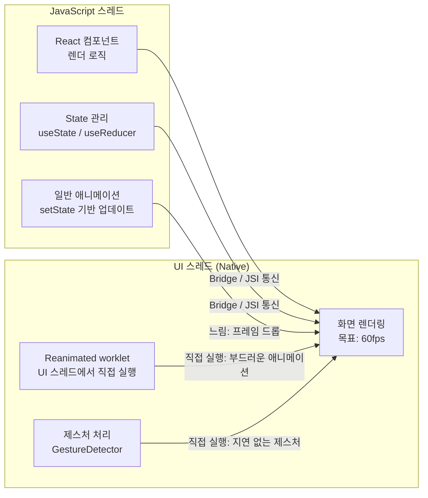
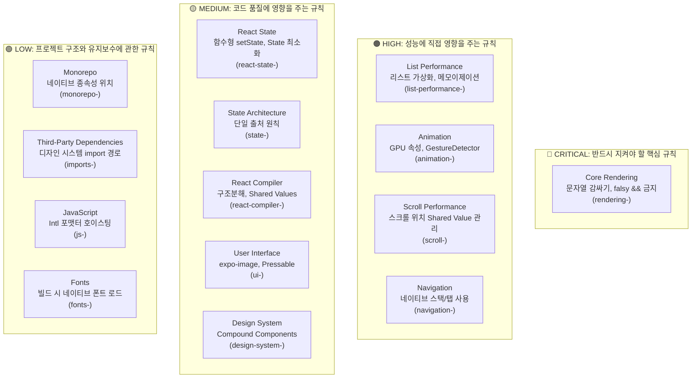
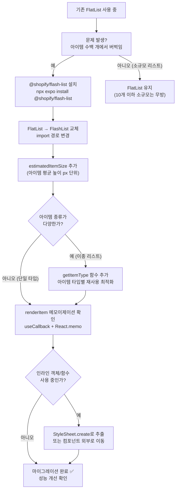

# React Native Skills (React Native 가이드라인)

## 스킬 소개

**React Native/Expo 앱 성능, 아키텍처, UI 패턴 규칙 30개 이상**을 에이전트에 심는 스킬입니다. 모바일 개발에서 놓치기 쉬운 성능 함정과 플랫폼별 모범 사례를 에이전트가 알아서 챙깁니다.

---

## 이 스킬이 필요한 이유

React Native는 웹과 다른 제약이 있습니다:

- **JavaScript 스레드 vs UI 스레드**: 애니메이션을 잘못 쓰면 JS 스레드가 막힙니다
- **FlatList 성능**: 아이템 수백 개 되면 메모이제이션 하나 빠뜨려도 버벅임이 납니다
- **플랫폼별 UI 패턴**: iOS와 Android 각각 네이티브답게 느껴지는 UI가 따로 있습니다

이런 모바일 특화 지식을 에이전트 안에 미리 심어두는 게 이 스킬입니다.

### JavaScript 스레드 vs UI 스레드 구조



> **핵심**: Reanimated의 `worklet`과 `GestureDetector`는 JS 스레드를 거치지 않고 UI 스레드에서 직접 실행되므로 JS 스레드가 바빠도 애니메이션이 끊기지 않습니다.

---

## 스킬 메타데이터

| 항목 | 내용 |
|------|------|
| **스킬 이름** | `react-native-skills` |
| **저자** | Vercel Engineering |
| **규칙 수** | 30개 이상 |
| **섹션 수** | 14개 |

---

## 14개 섹션 한눈에 보기

| 섹션 | 영향도 | 규칙 접두사 |
|------|-------|------------|
| Core Rendering (핵심 렌더링) | **CRITICAL** | `rendering-` |
| List Performance (리스트 성능) | **HIGH** | `list-performance-` |
| Animation (애니메이션) | **HIGH** | `animation-` |
| Scroll Performance (스크롤 성능) | **HIGH** | `scroll-` |
| Navigation (네비게이션) | **HIGH** | `navigation-` |
| React State | **MEDIUM** | `react-state-` |
| State Architecture | **MEDIUM** | `state-` |
| React Compiler | **MEDIUM** | `react-compiler-` |
| User Interface | **MEDIUM** | `ui-` |
| Design System | **MEDIUM** | `design-system-` |
| Monorepo | **LOW** | `monorepo-` |
| Third-Party Dependencies | **LOW** | `imports-` |
| JavaScript | **LOW** | `js-` |
| Fonts | **LOW** | `fonts-` |

### 섹션 영향도 구조도



---

## 섹션 1: Core Rendering (CRITICAL)

### `rendering-text-in-text-component` — 문자열은 Text 컴포넌트로 감싸라

```tsx
// 나쁜 예: JSX에 직접 문자열
<View>안녕하세요</View>

// 좋은 예
<View><Text>안녕하세요</Text></View>
```

### `rendering-no-falsy-and` — JSX에서 falsy && 연산자 금지

```tsx
// 나쁜 예: count가 0이면 "0" 렌더됨
{count && <Badge count={count} />}

// 좋은 예: 명시적 boolean 변환
{count > 0 && <Badge count={count} />}
// 또는 삼항 연산자
{count ? <Badge count={count} /> : null}
```

---

## 섹션 2: List Performance (HIGH)

### FlatList → FlashList 마이그레이션 흐름



리스트는 React Native 성능에서 가장 민감한 부분입니다. 구현이 조금만 어긋나도 아이템 수백 개쯤 되면 버벅임이 바로 납니다.

| 규칙 | 설명 |
|------|------|
| `list-performance-virtualize` | FlashList 또는 LegendList로 가상화 |
| `list-performance-function-references` | 안정적인 객체 참조 유지 |
| `list-performance-callbacks` | 콜백을 리스트 루트에서 호이스팅 |
| `list-performance-inline-objects` | renderItem에 인라인 객체 금지 |
| `list-performance-item-memo` | 메모이제이션을 위해 primitive 값 전달 |
| `list-performance-item-expensive` | 리스트 아이템은 가볍게 유지 |
| `list-performance-images` | 리스트에 압축 이미지 사용 |
| `list-performance-item-types` | 이종 리스트에 item types 사용 |

**핵심 예시: FlashList 적용**

```tsx
// 나쁜 예: FlatList (수백 개 아이템에서 느림)
<FlatList
  data={items}
  renderItem={({ item }) => <ItemComponent item={item} />}
/>

// 좋은 예: FlashList (재사용 가능한 셀로 최적화)
import { FlashList } from '@shopify/flash-list';

<FlashList
  data={items}
  renderItem={({ item }) => <ItemComponent item={item} />}
  estimatedItemSize={80}
/>
```

**인라인 객체 피하기:**

```tsx
// 나쁜 예: 매 렌더마다 새 객체 생성 → 리스트 아이템 전체 리렌더
const renderItem = ({ item }) => (
  <ItemComponent style={{ padding: 16 }} item={item} />
);

// 좋은 예: 스타일시트로 분리
const styles = StyleSheet.create({
  item: { padding: 16 }
});
const renderItem = ({ item }) => (
  <ItemComponent style={styles.item} item={item} />
);
```

---

## 섹션 3: Animation (HIGH)

### `animation-gpu-properties` — transform/opacity만 애니메이션하라

```tsx
// 나쁜 예: layout 속성 애니메이션 (JS 스레드 블로킹)
const animatedStyle = useAnimatedStyle(() => ({
  width: withSpring(width.value),  // layout 변경 = 느림
}));

// 좋은 예: GPU 속성만 (UI 스레드에서 실행)
const animatedStyle = useAnimatedStyle(() => ({
  transform: [{ scaleX: withSpring(scale.value) }],
  opacity: withSpring(opacity.value),
}));
```

### `animation-gesture-detector-press` — press 애니메이션에 GestureDetector

```tsx
// 좋은 예: GestureDetector + Reanimated
const gesture = Gesture.Tap()
  .onBegin(() => { scale.value = withSpring(0.95); })
  .onFinalize(() => { scale.value = withSpring(1); });

<GestureDetector gesture={gesture}>
  <Animated.View style={animatedStyle}>
    {children}
  </Animated.View>
</GestureDetector>
```

### `animation-derived-value` — useAnimatedReaction 대신 useDerivedValue

```tsx
// 좋은 예
const derivedOpacity = useDerivedValue(() =>
  interpolate(scrollY.value, [0, 100], [1, 0])
);
```

---

## 섹션 4: Scroll Performance (HIGH)

### `scroll-position-no-state` — 스크롤 위치를 useState에 저장하지 마라

스크롤 이벤트는 초당 수십 번 터집니다. 여기에 useState를 쓰면 그 횟수만큼 리렌더가 따라옵니다.

```tsx
// 나쁜 예: 매 스크롤마다 리렌더
const [scrollY, setScrollY] = useState(0);
<ScrollView onScroll={(e) => setScrollY(e.nativeEvent.contentOffset.y)} />

// 좋은 예: Reanimated shared value (UI 스레드에서 처리)
const scrollY = useSharedValue(0);
const scrollHandler = useAnimatedScrollHandler({
  onScroll: (event) => { scrollY.value = event.contentOffset.y; }
});
<Animated.ScrollView onScroll={scrollHandler} />
```

---

## 섹션 5: Navigation (HIGH)

### `navigation-native-navigators` — 네이티브 스택과 네이티브 탭 사용

```tsx
// 좋은 예: React Navigation 네이티브 스택
import { createNativeStackNavigator } from '@react-navigation/native-stack';

const Stack = createNativeStackNavigator();

function AppNavigator() {
  return (
    <Stack.Navigator>
      <Stack.Screen name="Home" component={HomeScreen} />
    </Stack.Navigator>
  );
}
```

---

## 섹션 6: React State (MEDIUM)

| 규칙 | 설명 |
|------|------|
| `react-state-dispatcher` | 함수형 setState 업데이트 사용 |
| `react-state-fallback` | State는 사용자 의도만 표현하라 |
| `react-state-minimize` | State 변수 최소화, 값 파생 |

---

## 섹션 7: State Architecture (MEDIUM)

### `state-ground-truth` — State는 하나의 출처에서만 관리해야 한다

```tsx
// 나쁜 예: 여러 곳에 동기화 필요한 상태
const [items, setItems] = useState([]);
const [itemCount, setItemCount] = useState(0); // 중복!

// 좋은 예: 파생 값
const [items, setItems] = useState([]);
const itemCount = items.length; // 파생
```

---

## 섹션 8: React Compiler (MEDIUM)

| 규칙 | 설명 |
|------|------|
| `react-compiler-destructure-functions` | 함수를 일찍 구조분해하라 |
| `react-compiler-reanimated-shared-values` | Shared Values에 `.get()`/`.set()` 사용 |

---

## 섹션 9: User Interface (MEDIUM)

| 규칙 | 설명 |
|------|------|
| `ui-expo-image` | 최적화된 이미지에 expo-image 사용 |
| `ui-image-gallery` | 라이트박스/갤러리에 Galeria 사용 |
| `ui-menus` | 네이티브 드롭다운/컨텍스트 메뉴에 Zeego |
| `ui-native-modals` | formSheet가 있는 네이티브 Modal 사용 |
| `ui-pressable` | TouchableOpacity 대신 Pressable |
| `ui-measure-views` | 뷰 크기 측정 방법 |
| `ui-safe-area-scroll` | contentInsetAdjustmentBehavior 사용 |
| `ui-scrollview-content-inset` | 동적 간격에 contentInset 사용 |
| `ui-styling` | 현대적 스타일링 패턴 (gap, boxShadow, 그라디언트) |

**Pressable 사용:**

```tsx
// 나쁜 예: deprecated
<TouchableOpacity onPress={handlePress}>
  <Text>버튼</Text>
</TouchableOpacity>

// 좋은 예
<Pressable
  onPress={handlePress}
  style={({ pressed }) => [styles.button, pressed && styles.pressed]}
>
  <Text>버튼</Text>
</Pressable>
```

---

## 섹션 10-14: Design System, Monorepo, Dependencies, JS, Fonts

| 규칙 | 설명 |
|------|------|
| `design-system-compound-components` | Compound Components 패턴 사용 |
| `monorepo-native-deps-in-app` | 네이티브 종속성은 app 디렉토리에 설치 |
| `monorepo-single-dependency-versions` | 단일 종속성 버전 유지 |
| `imports-design-system-folder` | 디자인 시스템 폴더에서 import |
| `js-hoist-intl` | Intl 포맷터 생성 호이스팅 |
| `fonts-config-plugin` | 빌드 시 네이티브 폰트 로드 |

---

## 사용 시점

| 상황 | 적용 섹션 |
|------|----------|
| React Native/Expo 앱 새로 만들기 | 전체 |
| FlatList 성능 개선 | 2(리스트 성능) |
| 애니메이션 구현 | 3(애니메이션) |
| 스크롤 이벤트 처리 | 4(스크롤) |
| 네비게이션 설정 | 5(네비게이션) |
| UI 컴포넌트 선택 | 9(UI) |

---

## 설치 및 활성화

```bash
cp -r ~/guide/origin/agent-skills/skills/react-native-skills ~/.claude/skills/
```

---

## 추가 자료

- **원본 스킬 파일**: `~/guide/origin/agent-skills/skills/react-native-skills/`
- **개별 규칙 파일**: `skills/react-native-skills/rules/` 폴더 내 파일들
- **컴파일된 전체 가이드**: `skills/react-native-skills/AGENTS.md`
