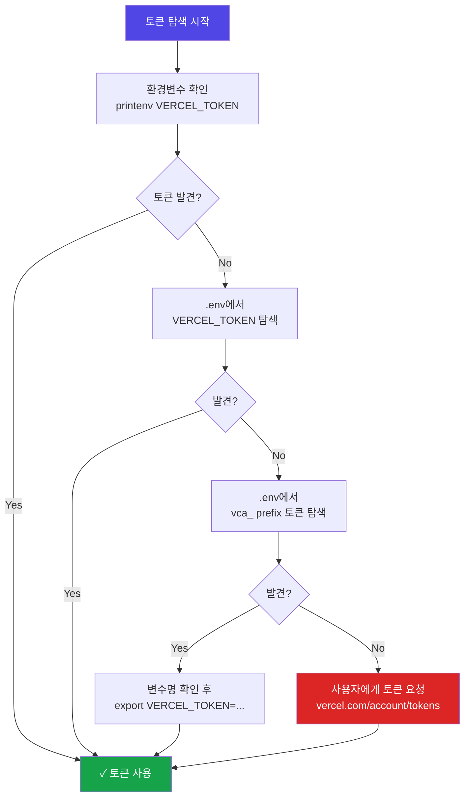
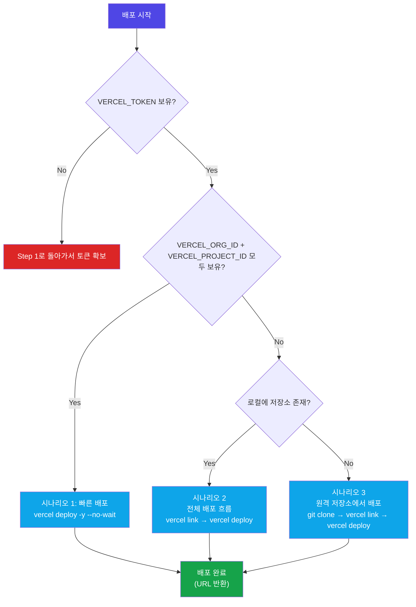
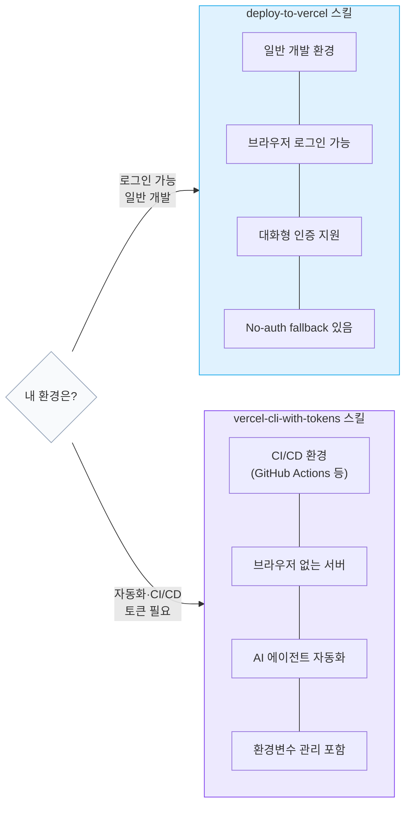

# Vercel CLI with Tokens (Vercel CLI 토큰 인증)

## 스킬 소개

**`vercel login` 없이 토큰으로 Vercel CLI를 쓰는 방법**을 에이전트에 심어두는 스킬입니다. CI/CD 파이프라인, 자동화 스크립트, 브라우저를 띄울 수 없는 환경에서 필요합니다.

---

## 이 스킬이 필요한 이유

`vercel login`은 브라우저에서 OAuth 인증을 끝내야 합니다. 그런데 현실은:

- **CI/CD 환경**: GitHub Actions, Jenkins에는 브라우저가 없음
- **서버 자동화**: 스크립트에서 Vercel 배포를 자동화할 때
- **AI 에이전트 환경**: 인터랙티브 입력 자체가 안 되는 환경

이 스킬은 `VERCEL_TOKEN` 환경변수로 토큰을 안전하게 쓰는 흐름을 처음부터 끝까지 안내합니다.

---

## 스킬 메타데이터

| 항목 | 내용 |
|------|------|
| **스킬 이름** | `vercel-cli-with-tokens` |
| **버전** | 1.0.0 |
| **저자** | Vercel Engineering |
| **핵심 보안 규칙** | 토큰을 `--token` 플래그로 전달하지 말 것 |

---

## Step 1: 토큰 찾기

에이전트는 다음 순서로 토큰을 찾습니다. 토큰을 직접 묻기 전에 반드시 이 순서를 따릅니다.



### A. 환경변수 확인

```bash
printenv VERCEL_TOKEN
```

값이 있으면 바로 사용합니다.

### B. .env 파일에서 `VERCEL_TOKEN` 찾기

```bash
grep '^VERCEL_TOKEN=' .env 2>/dev/null
```

찾으면 export:

```bash
export VERCEL_TOKEN=$(grep '^VERCEL_TOKEN=' .env | cut -d= -f2-)
```

### C. .env 파일에서 다른 이름의 Vercel 토큰 찾기

Vercel 토큰은 `vca_`로 시작합니다.

```bash
grep -i 'vercel' .env 2>/dev/null
```

찾은 변수명을 확인 후:

```bash
export VERCEL_TOKEN=$(grep '^<VARIABLE_NAME>=' .env | cut -d= -f2-)
```

### D. 사용자에게 요청

위 방법으로 토큰을 찾지 못한 경우에만 사용자에게 요청합니다.

> 토큰 생성: `vercel.com/account/tokens`

---

## 중요 보안 규칙

```bash
# 절대 금지: 토큰을 명령줄 인수로 전달
vercel deploy --token "vca_abc123"  # 셸 히스토리와 프로세스 목록에 노출!

# 올바른 방법: 환경변수로 설정
export VERCEL_TOKEN="vca_abc123"
vercel deploy  # CLI가 자동으로 환경변수에서 읽음
```

---

## Step 2: 프로젝트와 팀 확인

```bash
# 환경변수 또는 .env에서 확인
printenv VERCEL_PROJECT_ID
printenv VERCEL_ORG_ID

# .env 파일에서 Vercel 관련 설정 모두 확인
grep -i 'vercel' .env 2>/dev/null
```

`VERCEL_ORG_ID`와 `VERCEL_PROJECT_ID`가 **둘 다** 설정되면 `.vercel/` 디렉토리 없이도 배포 가능합니다. 단, 둘 중 하나만 설정하면 오류가 발생합니다.

---

## 배포 시나리오

아래 차트는 상황에 따라 어떤 시나리오를 선택해야 하는지 한눈에 보여줍니다.



### 시나리오 1: 빠른 배포 (Project ID 보유)

`VERCEL_TOKEN`, `VERCEL_ORG_ID`, `VERCEL_PROJECT_ID` 모두 환경변수에 있는 경우:

```bash
# 링크 없이 바로 배포 (가장 빠름)
vercel deploy -y --no-wait

# 팀 지정 시
vercel deploy --scope <team-slug> -y --no-wait

# 배포 상태 확인
vercel inspect <deployment-url>
```

### 시나리오 2: 전체 배포 흐름 (Project ID 없음)

```bash
# 1. 프로젝트 상태 확인
git remote get-url origin 2>/dev/null
cat .vercel/project.json 2>/dev/null || cat .vercel/repo.json 2>/dev/null

# 2. 프로젝트 링크
# git remote가 있는 경우 (권장)
vercel link --repo --scope <team-slug> -y

# git remote가 없는 경우
vercel link --scope <team-slug> -y

# 3. 배포
vercel deploy --scope <team-slug> -y --no-wait

# 또는 git push로 배포 (먼저 사용자 확인 필요)
git add .
git commit -m "deploy: 변경 사항"
git push
```

### 시나리오 3: 원격 저장소에서 배포

```bash
git clone <repo-url>
cd <repo-name>
vercel link --repo --scope <team-slug> -y
vercel deploy --scope <team-slug> -y --no-wait
```

---

## 환경변수 관리

```bash
# 환경변수 추가 (모든 환경)
echo "value" | vercel env add VAR_NAME --scope <team-slug>

# 특정 환경에만 추가 (production, preview, development)
echo "value" | vercel env add DATABASE_URL production --scope <team-slug>

# 환경변수 목록 확인
vercel env ls --scope <team-slug>

# 로컬 .env 파일로 내려받기
vercel env pull --scope <team-slug>

# 환경변수 삭제
vercel env rm VAR_NAME --scope <team-slug> -y
```

---

## 배포 관리

```bash
# 최근 배포 목록
vercel ls --format json --scope <team-slug>

# 특정 배포 상세 정보
vercel inspect <deployment-url>

# 빌드 로그 확인
vercel logs <deployment-url>
```

---

## 도메인 관리

```bash
# 도메인 목록
vercel domains ls --scope <team-slug>

# 도메인 추가
vercel domains add <domain> --scope <team-slug>
```

---

## .vercel/ 디렉토리 이해

| 파일 | 생성 방법 | 내용 |
|------|----------|------|
| `.vercel/project.json` | `vercel link` | `projectId`, `orgId` |
| `.vercel/repo.json` | `vercel link --repo` | `orgId`, `remoteName`, `projects` 맵 |

두 파일 중 하나라도 있으면 "linked" 상태입니다.

`VERCEL_ORG_ID` + `VERCEL_PROJECT_ID` 환경변수가 모두 있으면 `.vercel/` 없이도 동작합니다.

---

## 에이전트 작업 협약

이 스킬이 활성화되면 에이전트는 이 규칙대로 움직입니다:

- **토큰을 `--token` 플래그로 넘기지 않음** — 환경변수로만
- **환경과 .env부터 먼저 뒤짐** — 사용자에게 묻기 전에 스스로 탐색
- **기본은 프리뷰 배포** — production은 명시적으로 요청할 때만
- **git push 전 사용자 확인 필수** — 무단 push 절대 없음
- **`.vercel/` 파일 직접 수정 금지** — CLI가 알아서 관리
- **배포 URL curl/fetch 금지** — 링크만 돌려줌

---

## 문제 해결

### 토큰을 찾을 수 없는 경우

```bash
# 환경과 .env 파일 전체 확인
printenv | grep -i vercel
grep -i vercel .env 2>/dev/null
```

### 인증 오류 (Authentication required)

- 토큰이 만료되었거나 유효하지 않을 수 있습니다
- `vercel whoami` 실행 (VERCEL_TOKEN 환경변수 사용)
- 사용자에게 새 토큰 요청

### 잘못된 팀 오류

```bash
vercel whoami --scope <team-slug>
```

### 빌드 실패

```bash
vercel logs <deployment-url>
```

자주 발생하는 원인:
- `package.json`에 누락된 의존성
- 환경변수 누락 → `vercel env add`로 추가
- 프레임워크 감지 오류 → `vercel.json`으로 오버라이드

---

## 트리거 키워드

| 상황 | 트리거 |
|------|--------|
| CI/CD에서 Vercel 배포 | "CI에서 vercel 배포", "토큰으로 배포" |
| 환경변수 설정 | "vercel env 설정", "환경변수 추가" |
| 인터랙티브 로그인 불가 | "vercel login 없이 배포" |

---

## 설치 및 활성화

```bash
cp -r ~/guide/origin/agent-skills/skills/vercel-cli-with-tokens ~/.claude/skills/
```

---

## deploy-to-vercel과의 차이점

| 항목 | deploy-to-vercel | vercel-cli-with-tokens |
|------|-----------------|----------------------|
| **인증 방식** | 대화형 로그인 또는 no-auth fallback | 토큰 기반 |
| **적합한 환경** | 일반 개발 환경 | CI/CD, 자동화 |
| **No-auth fallback** | 있음 (스크립트) | 없음 |
| **환경변수 관리** | 없음 | 있음 |



---

## 추가 자료

- **원본 스킬**: `~/guide/origin/agent-skills/skills/vercel-cli-with-tokens/SKILL.md`
- **deploy-to-vercel 스킬**: [categories/deploy-to-vercel.md](deploy-to-vercel.md)
- **Vercel 토큰 생성**: `vercel.com/account/tokens`
