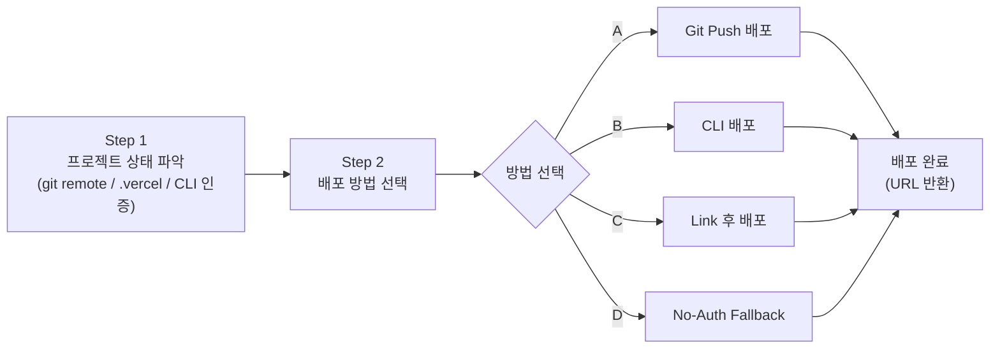
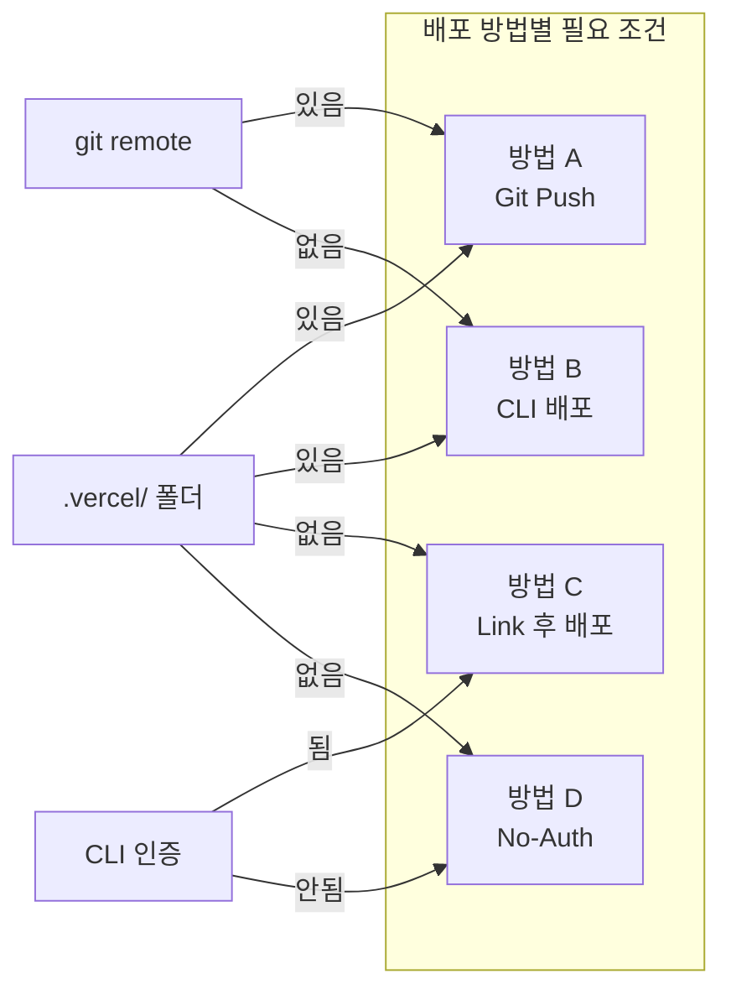
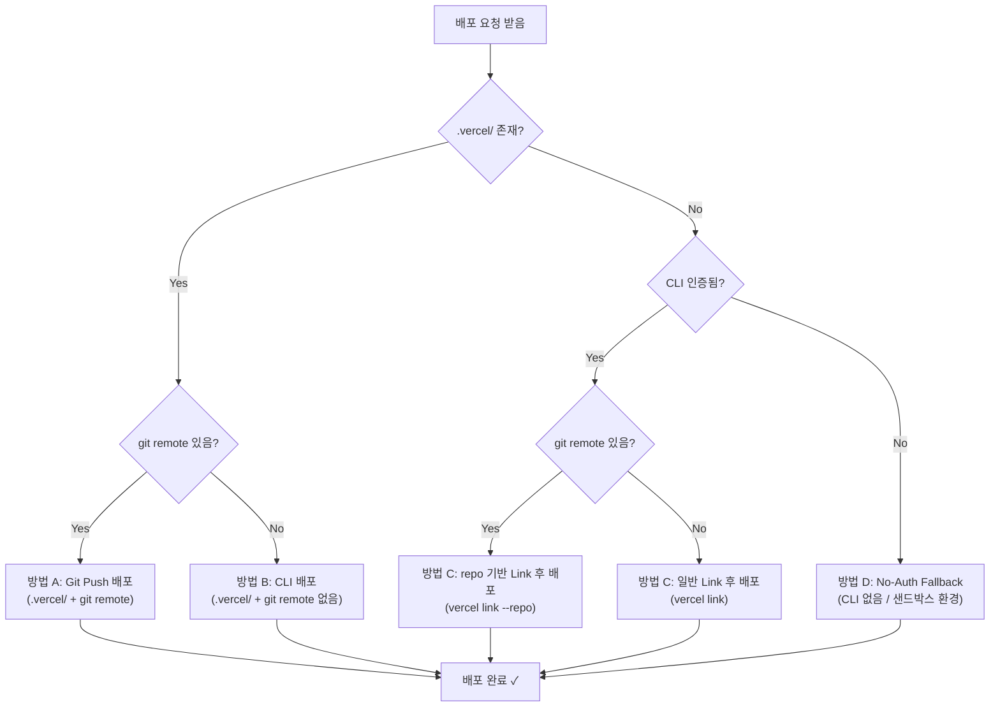

<!-- GENERATED BY build_obsidian_vaults.py -->
# Deploy to vercel

[[vercel-agent skills Guide - MOC]]

> [!info]
> source: `categories/deploy-to-vercel.md`  
> role: `category`

## Why this note matters

**어떤 프로젝트든 Vercel 배포 전 과정을 에이전트가 알아서 처리**하는 스킬입니다. 프로젝트 상태(linked/unlinked, CLI 인증 여부, git 원격 설정 여부)를 먼저 파악하고 상황에 맞는 배포 방법을 고릅니다.

## Source-adapted content

# Deploy to Vercel (Vercel 배포 자동화)

## 스킬 소개

**어떤 프로젝트든 Vercel 배포 전 과정을 에이전트가 알아서 처리**하는 스킬입니다. 프로젝트 상태(linked/unlinked, CLI 인증 여부, git 원격 설정 여부)를 먼저 파악하고 상황에 맞는 배포 방법을 고릅니다.

---

## 이 스킬이 필요한 이유

Vercel 배포 경로는 하나가 아닙니다:
- Git Push로 자동 배포
- `vercel deploy` CLI로 직접 배포
- CLI 없이 스크립트로 배포 (claude.ai 샌드박스 환경)

매번 상황 판단해서 명령어 찾을 필요 없이, 이 스킬이 알아서 분석해서 맞는 방법을 씁니다.

---

## 스킬 메타데이터

| 항목 | 내용 |
|------|------|
| **스킬 이름** | `deploy-to-vercel` |
| **버전** | 3.0.0 |
| **저자** | Vercel Engineering |
| **기본 배포 방식** | 프리뷰 (production은 명시적 요청 시만) |

---

## 배포 흐름 (4단계)

### Step 1: 프로젝트 상태 파악 (항상 먼저 실행)

에이전트는 배포 전에 반드시 다음 4가지를 확인합니다:

```bash
# 1. Git remote 존재 여부
git remote get-url origin 2>/dev/null

# 2. Vercel 프로젝트 링크 여부 (두 파일 중 하나면 됨)
cat .vercel/project.json 2>/dev/null || cat .vercel/repo.json 2>/dev/null

# 3. Vercel CLI 설치 및 인증 여부
vercel whoami 2>/dev/null

# 4. 사용 가능한 팀 목록
vercel teams list --format json 2>/dev/null
```

### Step 2: 배포 방법 선택

상태에 따라 4가지 방법 중 하나를 선택합니다.

아래는 전체 4단계 흐름을 한눈에 보여주는 다이어그램입니다.



---

## 배포 방법 4가지

아래 표는 각 방법의 조건을 한눈에 비교합니다.

| 방법 | `.vercel/` | git remote | CLI 인증 | 사용 환경 |
|------|:----------:|:----------:|:--------:|----------|
| **A. Git Push** | 필요 | 필요 | 선택 | 일반 개발 (권장) |
| **B. CLI 배포** | 필요 | 불필요 | 필요 | 로컬 전용 프로젝트 |
| **C. Link 후 배포** | 불필요 | 선택 | 필요 | 신규 프로젝트 연결 |
| **D. No-Auth Fallback** | 불필요 | 불필요 | 불필요 | 샌드박스 / 제한 환경 |



### 방법 A: Git Push 배포 (최적 상태)

**조건**: `.vercel/` 존재 + git remote 있음

가장 깔끔한 상태입니다. 이제부터 git push 한 번이면 자동으로 배포됩니다.

```bash
# 에이전트가 먼저 확인을 요청합니다:
# "이 프로젝트는 Vercel에 git으로 연결되어 있습니다.
#  커밋하고 push해서 배포할까요?"

git add .
git commit -m "deploy: 변경 사항 설명"
git push

# 배포 URL 확인 (CLI 인증된 경우)
sleep 5
vercel ls --format json
```

**결과**: non-main 브랜치 → 프리뷰 URL / main 브랜치 → 프로덕션 URL

---

### 방법 B: CLI 배포 (linked, no git)

**조건**: `.vercel/` 존재 + git remote 없음

```bash
vercel deploy [path] -y --no-wait

# 배포 상태 확인
vercel inspect <deployment-url>
```

---

### 방법 C: Link 후 배포 (linked 아님, CLI 인증됨)

**조건**: CLI 인증됨 + `.vercel/` 없음

에이전트가 팀 목록을 보여주고, 선택 후 즉시 진행합니다.

```bash
# Git remote가 있는 경우 (repo 기반 링크 - 더 정확함)
vercel link --repo --scope <team-slug>

# Git remote가 없는 경우
vercel link --scope <team-slug>

# 링크 후 배포
vercel deploy [path] -y --no-wait --scope <team-slug>
```

---

### 방법 D: No-Auth Fallback (CLI 없음 또는 미인증)

**조건**: CLI 설치 불가 또는 인증 불가 (claude.ai 샌드박스 등)

인증 없이도 배포 가능합니다. **Preview URL**과 **Claim URL**을 반환합니다.

```bash
# claude.ai 샌드박스에서
bash $MNT_ROOT/skills/user/deploy-to-vercel/resources/deploy.sh [path]

# Claude Code 로컬 설치에서
bash ~/.claude/skills/deploy-to-vercel/resources/deploy.sh [path]
```

**출력 예시:**
```
Deployment successful!

Preview URL: https://my-app-abc123.vercel.app
Claim URL:   https://vercel.com/claim-deployment?code=...

사이트를 Preview URL에서 확인하세요.
Claim URL에서 본인 Vercel 계정으로 이전할 수 있습니다.
```

---

## 배포 의사결정 트리

아래 차트는 에이전트가 배포 요청을 받았을 때 내부적으로 따르는 판단 흐름입니다. 조건을 위에서 아래로 체크하면 자동으로 올바른 방법에 도달합니다.



---

## 팀 선택

여러 팀에 속한 경우, 에이전트가 팀 목록을 보여주고 선택을 요청합니다:

```
다음 팀 중 어디에 배포할까요?
• my-personal-account
• my-company
• side-project-team
```

이미 링크된 프로젝트는 `.vercel/project.json`의 `orgId`로 팀을 자동 감지합니다.

---

## 배포 기본 정책

| 항목 | 기본값 |
|------|-------|
| **배포 환경** | 프리뷰 (preview) |
| **프로덕션 배포** | 사용자가 명시적으로 "production" 또는 "프로덕션"이라 할 때만 |
| **Git Push** | 사용자 확인 후 실행 |
| **URL 검증** | 하지 않음 (배포 URL만 반환) |

---

## 트리거 키워드

| 한국어 | English |
|--------|---------|
| "배포해줘" | "Deploy my app" |
| "Vercel에 올려줘" | "Push this live" |
| "프리뷰 URL 만들어줘" | "Create a preview" |
| "라이브로 올려줘" | "Deploy and give me the link" |

---

## 문제 해결

### claude.ai에서 네트워크 오류

```
Deployment failed due to network restrictions.

1. https://claude.ai/settings/capabilities 접속
2. *.vercel.com 허용 도메인에 추가
3. 다시 배포 시도
```

### CLI 인증 실패

```bash
# 토큰 기반 인증으로 전환
export VERCEL_TOKEN="vca_..."
vercel deploy
```

CLI 인증이 불가능한 환경이라면 `vercel-cli-with-tokens` 스킬로 전환하세요.

---

## 설치 및 활성화

```bash
cp -r ~/guide/origin/agent-skills/skills/deploy-to-vercel ~/.claude/skills/
```

---

## 추가 자료

- **원본 스킬**: `~/guide/origin/agent-skills/skills/deploy-to-vercel/SKILL.md`
- **배포 스크립트**: `skills/deploy-to-vercel/resources/deploy.sh`
- **Codex용 스크립트**: `skills/deploy-to-vercel/resources/deploy-codex.sh`
- **토큰 기반 배포**: [categories/vercel-cli-with-tokens.md](vercel-cli-with-tokens.md)
