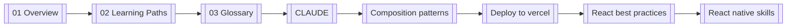

<!-- GENERATED BY build_obsidian_vaults.py -->
# vercel-agent skills Guide - MOC

> [!info]
> output mode: hybrid  
> repo guide: `vercel-agent-skills-guide/`  
> repo-local note pack: `obsidian/vercel-agent skills Guide/`  
> live vault target: `unset`  
> live sync status: `not applied`

## What this vault set is for

**AI 에이전트 스킬 실전 가이드**

## Start here

1. [[01 Overview]]
2. [[02 Learning Paths]]
3. [[03 Glossary]]
4. [[Deep Dives/CLAUDE]]
5. [[Categories/Composition patterns]]
6. [[Categories/Deploy to vercel]]
7. [[Categories/React best practices]]
8. [[Categories/React native skills]]
9. [[Categories/Vercel cli with tokens]]
10. [[Categories/Web design guidelines]]

## Reading graph

## Note map by purpose

### Categories
- [[Categories/Composition patterns]]
- [[Categories/Deploy to vercel]]
- [[Categories/React best practices]]
- [[Categories/React native skills]]
- [[Categories/Vercel cli with tokens]]
- [[Categories/Web design guidelines]]
### Deep Dives
- [[Deep Dives/CLAUDE]]
### Frontdoor
- [[01 Overview]]
- [[02 Learning Paths]]
- [[03 Glossary]]

## Safety rule

> [!warning]
> repo-local pack가 정본이다. live vault sync는 의도된 target이 명시적으로 정해지기 전까지 보류한다.

## Repo links

- repo frontdoor: `README.md`
- repo ↔ note mapping: `OBSIDIAN-VAULT-MAP.md`
- sync evidence: `UPSTREAM-SNAPSHOT.md`, `SYNC-LOG.md`
